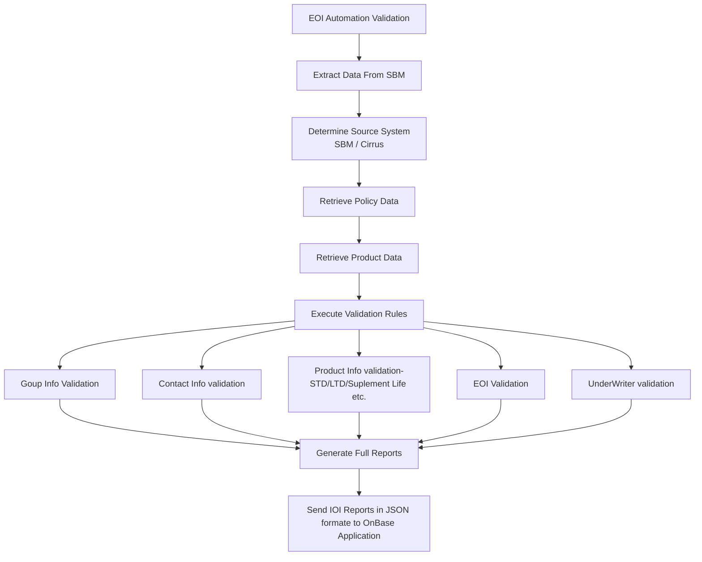

### EOI (Evidence of Insurability)

The EOI (Evidence of Insurability) Process Validation System is a rule-based automated underwriting platform designed to evaluate insurance coverage applications that exceed guaranteed issue limits. The system manages the complete lifecycle from application intake through validation, exception handling, underwriting decision, and audit compliance.


## Create Virtural Python Environment and Activate Python
```
python -m venv pylib

pylib\Script\activate

```
## Copy/Clone project From This Repository

```
git clone https://github.com/surendra83/eoi-process.git

cd eoi-validation-api

(pylib) C:\Users\srai78\project\eoi-validation-api>

```

## Run Application

```
uvicorn main:app --reload

```
# Browser API Test

http://localhost:8000/docs

## API Details

Method : POST

API URL : http://localhost:8000/sbm-eoi-automation/reports

### Request Payload:

```
{
  "groupNumber": "306455",
  "groupName": "Centerfield Media Holding Company"
}

```
Output of API is in Json Format

## Response body:

```
{
  "group_information": {
    "group_name": "Collaborative Care Services, Inc.",
    "group_policy_number": "303191",
    "group_effective_date": "01/01/2012",
    "group_termination_date": "12/31/2025",
    "situs_state": "TX",
    "plan_anniversary_date": "1/1",
    "underwriting_company": "UnitedHealthcare Insurance Co",
    "products_on_uhc": "UNET",
    "uhc_policy_number": "743787",
    "comments_general_info_gi": ""
  },
  "contact_information": [
    {
      "division_information": {
        "division_number": "2001",
        "division_name": "Wellmed Medical Group, P.A",
        "effective_date": "06/01/2018",
        "termination_date": ""
      },
      "eoi_primary_contact": {
        "contact_type": "Billing,Certificates,Claims,Eligibility,EOI,Executive (5500),Main/Plan Admin",
        "contact_name": "Kelly Pfankuch",
        "contact_title": "",
        "contact_email": "Kelly.Pfankuch1@uhg.com",
        "contact_company_name": "",
        "contact_address": "PO Box 9472",
        "contact_city_state_zip": "Minneapolis, MN 55440",
        "contact_phone": "952-936-1269",
        "contact_fax": ""
      },
      "eoi_secondary_contact": null,
      "comments_subgroup": ""
    },
    {
      "division_information": {
        "division_number": "2002",
        "division_name": "Optum Medical Services, P.C.",
        "effective_date": "06/01/2018",
        "termination_date": ""
      },
      "eoi_primary_contact": null,
      "eoi_secondary_contact": null,
      "comments_subgroup": ""
    },
    {
      "division_information": {
        "division_number": "2004",
        "division_name": "Centers for Family Medicine, GP",
        "effective_date": "06/01/2018",
        "termination_date": ""
      },
      "eoi_primary_contact": null,
      "eoi_secondary_contact": null,
      "comments_subgroup": ""
    },
    {
      "division_information": {
        "division_number": "2005",
        "division_name": "Greater Phoenix Collaborative Care, P.C.",
        "effective_date": "06/01/2018",
        "termination_date": ""
      },
      "eoi_primary_contact": null,
      "eoi_secondary_contact": null,
      "comments_subgroup": ""
    },
    {
      "division_information": {
        "division_number": "2006",
        "division_name": "XL Home",
        "effective_date": "06/01/2018",
        "termination_date": ""
      },
      "eoi_primary_contact": null,
      "eoi_secondary_contact": null,
      "comments_subgroup": ""
    },
    {
      "division_information": {
        "division_number": "2007",
        "division_name": "Monarch",
        "effective_date": "06/01/2018",
        "termination_date": ""
      },
      "eoi_primary_contact": null,
      "eoi_secondary_contact": null,
      "comments_subgroup": ""
    },
    {
      "division_information": {
        "division_number": "2010",
        "division_name": "Urology Specialists of NV",
        "effective_date": "06/01/2018",
        "termination_date": ""
      },
      "eoi_primary_contact": null,
      "eoi_secondary_contact": null,
      "comments_subgroup": ""
    },
    {
      "division_information": {
        "division_number": "2011",
        "division_name": "TeamMD Physicians of TX Inc",
        "effective_date": "06/01/2018",
        "termination_date": ""
      },
      "eoi_primary_contact": null,
      "eoi_secondary_contact": null,
      "comments_subgroup": ""
    },
    {
      "division_information": {
        "division_number": "2012",
        "division_name": "Mobile Medical Professionals, PC",
        "effective_date": "06/01/2018",
        "termination_date": ""
      },
      "eoi_primary_contact": null,
      "eoi_secondary_contact": null,
      "comments_subgroup": ""
    },
    {
      "division_information": {
        "division_number": "2013",
        "division_name": "Inspiris of New Jersey",
        "effective_date": "01/01/2019",
        "termination_date": ""
      },
      "eoi_primary_contact": {
        "contact_type": "Billing,Certificates,Claims,Eligibility,EOI,Executive (5500),Main/Plan Admin",
        "contact_name": "Kelly Pfankuch",
        "contact_title": "",
        "contact_email": "Kelly.Pfankuch1@uhg.com",
        "contact_company_name": "",
        "contact_address": "PO Box 9472",
        "contact_city_state_zip": "Minneapolis, MN 55440",
        "contact_phone": "952-936-1269",
        "contact_fax": ""
      },
      "eoi_secondary_contact": null,
      "comments_subgroup": ""
    },
    {
      "division_information": {
        "division_number": "2014",
        "division_name": "Medical Clinics of Texas",
        "effective_date": "01/01/2019",
        "termination_date": ""
      },
      "eoi_primary_contact": null,
      "eoi_secondary_contact": null,
      "comments_subgroup": ""
    },
    {
      "division_information": {
        "division_number": "2015",
        "division_name": "Optumcare Florida LLC",
        "effective_date": "02/01/2021",
        "termination_date": ""
      },
      "eoi_primary_contact": null,
      "eoi_secondary_contact": null,
      "comments_subgroup": ""
    },
    {
      "division_information": {
        "division_number": "2016",
        "division_name": "Optum Medical Services of CA, PC",
        "effective_date": "07/01/2021",
        "termination_date": ""
      },
      "eoi_primary_contact": null,
      "eoi_secondary_contact": null,
      "comments_subgroup": ""
    },
    {
      "division_information": {
        "division_number": "2017",
        "division_name": "WFS (WellMed Florida Services, PLLC",
        "effective_date": "01/01/2022",
        "termination_date": ""
      },
      "eoi_primary_contact": null,
      "eoi_secondary_contact": null,
      "comments_subgroup": ""
    },
    {
      "division_information": {
        "division_number": "2018",
        "division_name": "Healthcare Associates of Irving PLLC /HCA",
        "effective_date": "01/01/2024",
        "termination_date": ""
      },
      "eoi_primary_contact": null,
      "eoi_secondary_contact": null,
      "comments_subgroup": ""
    }
  ],
  "eligibility": [
    {
      "full_time_employees_effective_on": "An Employee is eligible for insurance on the first day of the month following the date he begins continuous employment with the Policyholder, or earlier if subject to an acquisition integration agreement.",
      "waiting_period_design": "(None)",
      "waiting_period_description": "(None)",
      "waiting_period_prefix": "(None)",
      "full_time_hours_per_week": "30",
      "rehire_provision": "No",
      "explain_rehire_provision": "",
      "comments": "Medical LOA 24 months\r\n\r\nAn employee who immediately transfers from UHC (policy # 168504) to Collaborative Care (policy # 303191) may elect Employee and Dependent Supplemental Life/AD&D coverage up to the lesser of: \r\na)\tthe amount of coverage he/she was insured for under the UHC plan on the day prior to the date of hire with Collaborative Care or, \r\nb)\tthe maximum amount of coverage available under the Collaborative Care plan.\r\nNo proof of good health will be required for these amounts\r\nAll amounts must be in compliance with the Collaborative Care plan designs and limitations.\r\n\r\nNotes:\r\n•\tIf an employee or dependent did not have Supplemental coverage under the UHC plan then they would be considered a late entrant to the Supplemental Life/AD&D coverage under the Collaborative car plan and proof of good health would be required\r\n•\tThe employee amount of Supplemental coverage under the UHC plan is an earnings schedule.  This amount would be rounded up to the next higher $10,000 for the Collaborative Care coverage (prior to any age reductions)\r\n•\tThe Collaborative Care plan will apply for the Basic Life/AD&D\r\n•\tThe employee waiting period with Collaborative Care will be waived for the Basic and Supplemental Life/AD&D coverages\r\n•\tThere may not be a break in coverage from the termination date with UHC and the date of hire with Collaborative Care"
    }
  ],
  "product_information": {
    "basic_life": {
      "effective_date_basic_life": "01/01/2012",
      "termination_date_basic_life": "",
      "guarantee_issue_amount_basic_life": "Class 1: $500,000\r\nClass 2: $10,00",
      "define_earnings_basic_life": "Other - Explain in Comments",
      "rounding_basic_life": "Rounded up to next higher $1,000",
      "open_enrollment": {
        "open_enrollment_offered_basic_life": "No",
        "open_enrollment_term_date_basic_life": "",
        "guarantee_issue_onetime_open_enrollment_basic_life": "",
        "guarantee_issue_annual_open_enrollment_basic_life": ""
      },
      "underwriting": {
        "na_takeover_for_ee_basic_life": "No",
        "eoi_req_newly_elig_ee_basic_life": "Yes - For Benefit Amounts Above the GI",
        "med_uw_new_ee_over_gi_basic_life": "Yes",
        "med_uw_salary_over_gi_basic_life": "Yes",
        "for_contrib_plans_medical": "Yes",
        "other_basic_life": null,
        "eoi_req_if_elect_cov_oe_basic_life": "N/A",
        "current_ee_no_bl_basic_life": "N/A",
        "current_ee_increase_amt_basic_life": "N/A"
      },
      "benefit_and_rate_information": [
        {
          "product_type": "Basic Life",
          "effective_date": "01/01/2021",
          "termination_date": "",
          "class_code": "2",
          "insurance_class_of_ee": "All Active Part Time Employees working less than 20 hours",
          "full_benefit_description": "$10,000",
          "comments": ""
        },
        {
          "product_type": "Basic Life",
          "effective_date": "01/01/2021",
          "termination_date": "",
          "class_code": "1",
          "insurance_class_of_ee": "See comments",
          "full_benefit_description": "1X BAE up to $500,000",
          "comments": "All Active Full Time Employees and all Active Part Time Employees working a minimum of 20 hours per week."
        }
      ],
      "comments_basic_life_bl": "Life – The 2024 Life Insurance COC should be updated from 30 days to 31 days in the below statement: If the Covered Person dies within the 30 days allowed for making application to convert, We will pay the amount he was entitled to convert. We will do this whether or not application was made.\r\n\r\nDef of Earnings:\r\nEmployee’s Benefit Compensation Definition:\r\n- Your Base Pay as of the later of August 31 that precedes the annual Open Enrollment Period for a calendar year, your Hire Date or the date you transfer to an Eligible Employee class; plus\r\n- The average of the Incentive Compensation paid to you during the two-year period that ends on August 31 of the calendar year that precedes the calendar year for which coverage will be in effect (if you only received Incentive Compensation in one year out of the past two, your one year of Incentive Compensation will be used). Your Benefit Compensation is calculated once each year on August 31 for coverage that will be effective on January 1 of the following year. If your Base Pay increases or decreases during the year, your Benefits Compensation will not change.\r\n\r\nBase Pay\r\n- Your annual rate of pay, including shift differentials (as part of your regular earnings – shift differential is based on the 12-month period that ends on the August 31 of the calendar year that precedes the calendar year for which coverage will be in effect), but excluding other forms of compensation including overtime, all forms of Incentive Compensation, bonus payments, commissions, and amounts received from exercise of stock options. To determine benefit coverage, benefit compensation is rounded to the next higher $1,000, if not equal to $1,000, then multiplied.\r\n\r\nIncentive Compensation\r\n- Your amount of Life/AD&D coverage, and depending on your salary grade level, your incentive compensation may include incentive opportunities through performance-based compensation and sales incentives.\r\n- Your incentive compensation does not include any overtime pay or amounts received pursuant to the exercise of the Company stock options. It also does not include one-time special payments or awards (such as spot awards, etc.)."
    },
    "supplemental_life": {
      "effective_date_sl": "01/01/2012",
      "termination_date_sl": "",
      "virgin_line_coverage_sl": "Yes",
      "guaranteed_issue_amount_sl": "The lesser of $500,000 or 2 times the Employee's BAE",
      "reduce_sch_sl": "Other",
      "definition_of_earnings_sl": "Other - Explain in Comments",
      "rounding_sl": "N/A (flat $ amount)",
      "expected_reduce_sch_sl": "None",
      "open_enrollment": {
        "open_enrollment_offered": "Yes",
        "open_enrollment_initial": "One time event (Full GI)",
        "gi_restriction": "",
        "open_enrollment_subsequent_anniversaries": "Other - Explain in Comments",
        "open_enrollment_termination_date": "12/31/2018"
      },
      "underwriting": {
        "participation_requirement_met_sl": "Yes",
        "na_takeover_for_ee_sl": "No",
        "eoi_req_newly_elig_ee_sl": "Yes - For Benefit Amounts Above the GI",
        "eoi_new_hire_over_gi_sl": "Yes",
        "eoi_cov_31_days_sl": "Yes",
        "eoi_for_incr_cov_sl": "Yes",
        "eoi_for_1_bene_lvl_sl": "N/A",
        "one_benefit_level_sl": "",
        "other_eoi_sl": "",
        "eoi_salary_over_gi_sl": "Yes",
        "amount_over_gi_sl": "",
        "amounts_above_gi_sl": "Yes",
        "other_special_provisions_sl": null,
        "eoi_req_if_elect_cov_oe_sl": "N/A",
        "current_ee_no_bl_sl": "N/A",
        "current_ee_increase_amt_sl": "N/A"
      },
      "benefit_and_rate_information": [
        {
          "product_type": "Supp Life",
          "effective_date": "01/01/2021",
          "termination_date": "",
          "class_code": "1",
          "insurance_class_of_ee": "All Active Full Time and Part Time Employees",
          "full_benefit_description": "1 to 5X BAE up to $1,000,000",
          "comments": ""
        }
      ],
      "comments_sl": "An Employee: Who is insured for Supplemental Life may increase coverage by an increment of 1 times the Employee's Basic Annual Earnings with no proof of good health not to exceed the Guaranteed Issue Limit of $500,000 (not to exceed 2 times the Employee's Basic Annual Earnings) as long as not previously declined for an increase in coverage by UnitedHealthcare.\r\n\r\nSee CR024826 - UW Approval  If the Employee and Spouse are both Employees of the policyholder, both Employees may elect to cover each other as dependents, but only one of them can elect coverage for the dependent child.\r\n\r\nelig for Insurance under the policy as a covered person\r\n\r\nIf the Employee and Spouse are both Employees of the policyholder, both Employees may elect to cover each other as dependents, but only one of them can elect coverage for the dependent child.\r\n\r\nelig for Insurance under the policy as a covered person\r\n\r\nDef of Earnings:\r\nEmployee’s Benefit Compensation Definition:\r\n- Your Base Pay as of the later of August 31 that precedes the annual Open Enrollment Period for a calendar year, your Hire Date or the date you transfer to an Eligible Employee class; plus\r\n- The average of the Incentive Compensation paid to you during the two-year period that ends on August 31 of the calendar year that precedes the calendar year for which coverage will be in effect (if you only received Incentive Compensation in one year out of the past two, your one year of Incentive Compensation will be used). Your Benefit Compensation is calculated once each year on August 31 for coverage that will be effective on January 1 of the following year. If your Base Pay increases or decreases during the year, your Benefits Compensation will not change.\r\n\r\nBase Pay\r\n- Your annual rate of pay, including shift differentials (as part of your regular earnings – shift differential is based on the 12-month period that ends on the August 31 of the calendar year that precedes the calendar year for which coverage will be in effect), but excluding other forms of compensation including overtime, all forms of Incentive Compensation, bonus payments, commissions, and amounts received from exercise of stock options. To determine benefit coverage, benefit compensation is rounded to the next higher $1,000, if not equal to $1,000, then multiplied.\r\n\r\nIncentive Compensation\r\n- Your amount of Life/AD&D coverage, and depending on your salary grade level, your incentive compensation may include incentive opportunities through performance-based compensation and sales incentives.\r\n- Your incentive compensation does not include any overtime pay or amounts received pursuant to the exercise of the Company stock options. It also does not include one-time special payments or awards (such as spot awards, etc.). \r\n\r\n\r\nSuicide Limitation 2 years\r\n\r\nFor the Initial Supplemental Life/AD&D Enrollment Period effecitve January 1, 2019. An Employee: May elect up to the Guarantee Issue Limit of $150,000 with no proof of good health as long as not previously declined for coverage or declined for an increase in coverage by UnitedHealthcareA Spouse: May elect up to the Guarantee Issue Limit of $20,000 with no proof of good health as long as not previously declined for coverage or declined for an increase in coverage by UnitedHealthcareA Child: May elect up to $10,000 with no proof of good health as long as not previoulsy declined for coverage or declined for an increase in coverage by UnitedHealthcare.Notes: 1. The enrollment should be completed and the final census submitted by December 31, 20182. The above limits are based on amounts prior to any age reductions3. All requested amounts are subject to the Supplemental plan designs and limitations4. An employee or spouse may elect an amount greater than the Guarantee Issue Limit however proof of good health must be submitted and approved for amounts in excess of the Guarantee Issue Limit.5. The actively at work requirement for the employees and the non-confinement in a hospital or medical facility requirement for the dependents will apply for any increased amount6. An employee or dependent whose current amount is at or over the Guarantee Issue Limit must submit satisfactory proof of good health and be approved for any increase in coverage.7. An employee or dependent who has been declined for coverage or declined for an increase in coverage must submit satisfactory proof of good health and be approved for any increase in coverage.\r\n\r\nDuring the employer’s future scheduled Supplemental Life Annual Enrollment Periods: An Employee: Who is insured for Supplemental Life may increase coverage by 1 incremental level of $10,000 with no proof of good health not to exceed the Guaranteed Issue Limit of $150,000 as long as not previously declined for an increase in coverage by UnitedHealthcare. A Spouse: Who is insured for Supplemental Dependent Life may increase coverage by 1 incremental level of $5,000 with no proof of good health not to exceed the Guaranteed Issue Limit of $20,000 as long as the Spouse was not previously declined for an increase in coverage by UnitedHaelthcare.A Child: May elect coverage up to $10,000 with no proof of good health as long as the child was not previously declined for coverage or declined for an increase in coverage by UnitedHealthcare.Notes: 1. The enrollment should be completed and the final census submitted by Decembe 31st.2. The above limits are based on amounts prior to any age reductions3. All requested amounts are subject to the Supplemental plan designs and limitations4. The actively at work requirement for the employees and the non-confinement in a hospital or medical facility requirement for the dependents will apply for any increased amount. 5. An employee or spouse who is not insured for Supplemental Life is considered a late applicant and must submit satisfactory proof of good health and be approved for any amount of coverage. 6. An employee or dependent whose current amount is at or over the Guarantee Issue Limit must submit satisfactory proof of good health and be approved for any increase in coverage.7. An employee or dependent who has been declined for coverage or declined for an increase in coverage must submit satisfactory proof of good health and be approved for any increase in coverage.\r\nLimitations for AD&D: Disease, bodily or mental infirmity, suicide or intentionally self-inflicted injury, commission of an assault or felony, war, use of any drug unless prescribed by a physician, driving while intoxicated, engaging in any hazardous activities, or travel in a private aircraft. Additional exclusions may apply depending upon the plan design of the employer."
    },
    "supplemental_dependent_life": {
      "effective_date_sdl": "01/01/2012",
      "termination_date_sdl": "",
      "virgin_line_coverage_sdl": "Yes",
      "spouse_guaranteed_issue_amount_sdl": "$20,000",
      "spouse_age_reduction_sdl": "No",
      "open_enrollment": {
        "open_enroll_offered_sdl": "Yes",
        "open_enroll_initial_sdl": "One time event (Full GI)",
        "gi_restriction_sdl": "",
        "open_enroll_anniv_sdl": "Other - Explain in Comments",
        "oe_term_date_sdl": "12/31/2018"
      },
      "underwriting": {
        "must_employee_covered_for_sdl": "Yes",
        "is_supp_spouse_dl_amt_limited": "Yes - 50% (Standard)",
        "participation_requirement_sdl": "Yes",
        "current_employee_no_bl_sdl": "N/A",
        "current_employee_increase_am-ount_sd": "N/A",
        "na_takeover_for_employee_sdls": "No",
        "eoi_new_hire_over_guaranteed_issue_sdls": "Yes",
        "eoi_other_eoi_rules_sdls": "",
        "eoi_for_increase_coverage_amount_sdls": "Yes",
        "eoi_one_benefit_level_sdls": "N/A",
        "eoi_coverage_within_31_days_sdls": "Yes",
        "eoi_required_for_newly_eligible_employees_sdls": "Yes - For Benefit Amounts Above the GI",
        "eoi_required_if_elected_coverage_open_enrollment_sdls": "N/A",
        "one_benefit_level_equals_sdls": ""
      },
      "benefit_and_rate_information": [
        {
          "product_type": "Supp Dep Life",
          "effective_date": "02/01/2024",
          "termination_date": "",
          "class_code": "1",
          "insurance_class_of_ee": "All Active Full Time Employees and all Active Part Time Employees",
          "full_benefit_description": "Increments of $5,000 max of $100,000",
          "comments": ""
        }
      ],
      "comments_sdl": "An Employee does not have to be enrolled in Supplemental Life/AD&D in order for his/her Dependents to be\r\nenrolled in Supplemental Dependent Life/AD&D\r\n\r\nSee CR024826 - UW Approval  If the Employee and Spouse are both Employees of the policyholder, both Employees may elect to cover each other as dependents, but only one of them can elect coverage for the dependent child.\r\n\r\nelig for Insurance under the policy as a covered person\r\n\r\n\r\nBenefit Reduction To 65% at the Employees age 65* and to 50% at the Employee's age 70** The reduced amount is rounded to the next higher $5,000\r\n\r\nSpouse Supp For Clarity in COC only add: the age reduction to: To 65% at Employee's age 65, 50% at Employee's age 70\r\n\r\nSuicide Limitation - 2 years\r\n\r\nFor the Initial Supplemental Life/AD&D Enrollment Period effecitve January 1, 2019. An Employee: May elect up to the Guarantee Issue Limit of $150,000 with no proof of good health as long as not previously declined for coverage or declined for an increase in coverage by UnitedHealthcareA Spouse: May elect up to the Guarantee Issue Limit of $20,000 with no proof of good health as long as not previously declined for coverage or declined for an increase in coverage by UnitedHealthcareA Child: May elect up to $10,000 with no proof of good health as long as not previoulsy declined for coverage or declined for an increase in coverage by UnitedHealthcare.Notes: 1. The enrollment should be completed and the final census submitted by December 31, 20182. The above limits are based on amounts prior to any age reductions3. All requested amounts are subject to the Supplemental plan designs and limitations4. An employee or spouse may elect an amount greater than the Guarantee Issue Limit however proof of good health must be submitted and approved for amounts in excess of the Guarantee Issue Limit.5. The actively at work requirement for the employees and the non-confinement in a hospital or medical facility requirement for the dependents will apply for any increased amount6. An employee or dependent whose current amount is at or over the Guarantee Issue Limit must submit satisfactory proof of good health and be approved for any increase in coverage.7. An employee or dependent who has been declined for coverage or declined for an increase in coverage must submit satisfactory proof of good health and be approved for any increase in coverage.\r\n\r\nDuring the employer’s future scheduled Supplemental Life Annual Enrollment Periods: An Employee: Who is insured for Supplemental Life may increase coverage by 1 incremental level of $10,000 with no proof of good health not to exceed the Guaranteed Issue Limit of $150,000 as long as not previously declined for an increase in coverage by UnitedHealthcare. A Spouse: Who is insured for Supplemental Dependent Life may increase coverage by 1 incremental level of $5,000 with no proof of good health not to exceed the Guaranteed Issue Limit of $20,000 as long as the Spouse was not previously declined for an increase in coverage by UnitedHaelthcare.A Child: May elect coverage up to $10,000 with no proof of good health as long as the child was not previously declined for coverage or declined for an increase in coverage by UnitedHealthcare.Notes: 1. The enrollment should be completed and the final census submitted by Decembe 31st.2. The above limits are based on amounts prior to any age reductions3. All requested amounts are subject to the Supplemental plan designs and limitations4. The actively at work requirement for the employees and the non-confinement in a hospital or medical facility requirement for the dependents will apply for any increased amount. 5. An employee or spouse who is not insured for Supplemental Life is considered a late applicant and must submit satisfactory proof of good health and be approved for any amount of coverage. 6. An employee or dependent whose current amount is at or over the Guarantee Issue Limit must submit satisfactory proof of good health and be approved for any increase in coverage.7. An employee or dependent who has been declined for coverage or declined for an increase in coverage must submit satisfactory proof of good health and be approved for any increase in coverage.\r\nLimitations for AD&D: Disease, bodily or mental infirmity, suicide or intentionally self-inflicted injury, commission of an assault or felony, war, use of any drug unless prescribed by a physician, driving while intoxicated, engaging in any hazardous activities, or travel in a private aircraft. Additional exclusions may apply depending upon the plan design of the employer."
    },
    "short_term_disability_std": {
      "benefit_percentage_std": "60% (standard)",
      "effective_date_std": "01/01/2017",
      "elimination_period_for_injury_std": "7 days (standard)",
      "define_earnings_std": "Avg weekly earnings (3-month period) - commissions EXCLUDED",
      "max_bene_period_std": "25 weeks",
      "termination_date_std": "02/29/2020",
      "elimination_period_for_sickness_std": "7 days (standard)",
      "maximum_weekly_benefit_std": "Other",
      "std_minimum_participation_std": "100% (Standard if Non-Contributory)",
      "std_guarantee_issue_benefit_std": "Same as Maximum Weekly Benefit",
      "explain_maximum_weekly_benefit_std": "Unlimited",
      "open_enrollment": {
        "oe_term_date_std": "",
        "open_enroll_offer_std": "No"
      },
      "buy_up": {
        "buy_up_option_std": "No",
        "maximum_benefit_period_weeks_std_buyup": null,
        "minimum_participation_std_buyup": null,
        "benefit_percentage_std_buyup": null,
        "elim_period_inj_std_buyup": null,
        "elim_period_sick_std_buyup": null,
        "oe_term_date_std_buyup": "",
        "oe_offer_std_buyup": null,
        "max_week_bene_std_buyup": null,
        "std_guarantee_std_buyup": null,
        "expected_std_buyup_min_part": "",
        "minimum_week_benefit_std_buyup": null,
        "comments_std_buyup": ""
      },
      "underwriting": {
        "eoi_coverage_31_days_std": "No",
        "eoi_new_hire_over_gi_std": "No",
        "na_takeover_for_ee_std": "No",
        "other_std": null,
        "eoi_req_newly_elig_ee_std": "No",
        "eoi_req_if_elect_cov_oe_std": "N/A",
        "current_ee_no_bl_std": "N/A",
        "current_ee_increase_amt_std": "N/A",
        "eoi_coverage_31_days_std_buyup": "N/A",
        "eoi_for_incr_cov_std_buyup": "N/A",
        "na_takeover_for_ee_std_buyup": "N/A",
        "eoi_req_newly_elig_ee_std_buyup": "N/A",
        "eoi_new_hire_over_gi_std_buyup": "N/A",
        "other_std_buyup": null
      },
      "benefit_and_rate_information": [],
      "comments_std": ""
    },
    "long_term_disability_ltd": {
      "effective_date_ltd": "01/01/2012",
      "termination_date_ltd": "02/29/2020",
      "maximum_month_benefit_ltd": "Other ",
      "benefit_percentage_ltd": "60% (standard)",
      "exp_max_month_ben_ltd": "$15,000",
      "define_earnings_ltd": "Other - Explain in Comments",
      "elim_period_ltd": "180 days (standard)",
      "ltd_guarant_iss_ben": "Same as Maximum Monthly Benefit",
      "ltd_min_participate": "100% (Standard if Non-Contributory)",
      "max_bene_period_ltd": "Reducing Benefit Duration w/SSNRA",
      "open_enrollment": {
        "open_enrollment_offered": "No",
        "open_enrollment_termination_date": "",
        "guaranteed_issue_annual_open_enrollment": "",
        "guaranteed_issue_onetime_open_enrollment": ""
      },
      "buy_up": {
        "ltd_buyup_option": "No",
        "open_enrollment_offered_ltd_buyup": null,
        "guarantee_issue_limits_n_ltd_byup": null,
        "open_enrollment_termination_date_ltd_buyup": "",
        "guaranteed_issue_annual_open_enrollment_ltd_buyup": "",
        "guaranteed_issue_onetime_open_enrollment_ltd_buyup": "",
        "benefit_percentage_ltd_buyup": null,
        "maximum_month_buyup_option_ltd": null,
        "minimum_month_benefit_ltd_buyup": null,
        "comments_ltd_buyup": ""
      },
      "underwriting": {
        "eoi_req_newly_elig_ee_ltd": "No",
        "na_takeover_for_ee_ltd": "No",
        "eoi_new_hire_over_gi_ltd": "Yes",
        "eoi_cov_31_days_ltd": "No",
        "other_ltd": "",
        "eoi_req_if_elect_cov_oe_ltd": "N/A",
        "current_ee_no_bl_ltd": "N/A",
        "current_ee_increase_amt_ltd": "N/A",
        "na_takeover_for_ee_ltd_buyup": "N/A",
        "eoi_req_newly_elig_ee_ltd_buyup": "N/A",
        "eoi_new_hire_over_gi_ltd_buyup": "N/A",
        "eoi_cov_31_days_ltd_buyup": "N/A",
        "eoi_for_incr_cov_ltd_buyup": "N/A",
        "other_ltd_buyup": "",
        "buy_up_billing_method_ltd": null
      },
      "benefit_and_rate_information": [],
      "comments_ltd": "Definition of Earnings - Basic earnings incl. 24 month avg of commissions but excl. bonuses, overtime pay, shift differential or any other earnings.\r\n\r\nOwn Occ Period: to age 65\r\nRegular Occupation for Class 2-Physicians - Specialty occupation\r\nRegular Occupation for Class 3-Non-Physicians - standard regular occupation"
    },
    "billing_enrollment_info": [
      {
        "self_bill_temp": "No",
        "lifeadd_bill_meth": "EDI List Bill",
        "employee_paid": {
          "employee_paid_bl": "0 %",
          "employee_paid_dl": "0 %",
          "employee_paid_sl": "100 %",
          "employee_paid_sdl": "100 %",
          "employee_paid_ltd": "0 %",
          "employee_paid_std": "0 %",
          "employee_paid_std_buyup": "0 %",
          "employee_paid_ltd_buyup": "0 %"
        },
        "employer_paid": {
          "employer_paid_bl": "100 %",
          "employer_paid_dl": "0 %",
          "employer_paid_sl": "0 %",
          "employer_paid_sdl": "0 %",
          "employer_paid_ltd": "",
          "employer_paid_std": "",
          "employer_paid_std_buyup": "0 %",
          "employer_paid_ltd_buyup": "0 %"
        },
        "comments": ""
      }
    ]
  }
}
```

## EOI (Evidence of Insurability) Validation  Process flow

